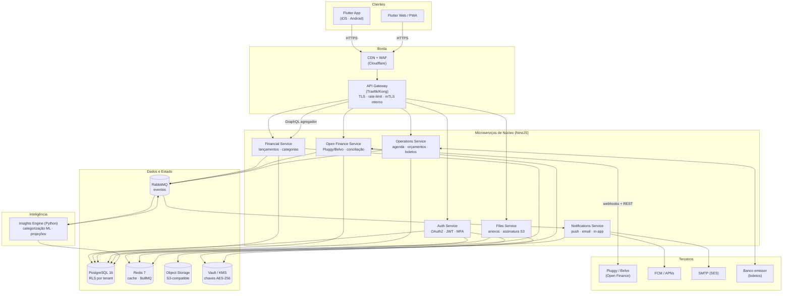
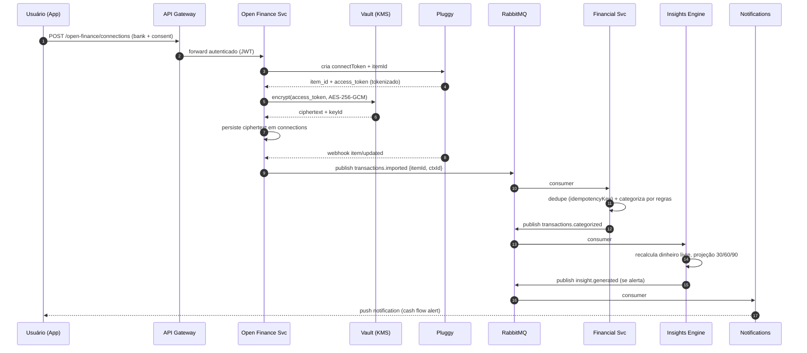
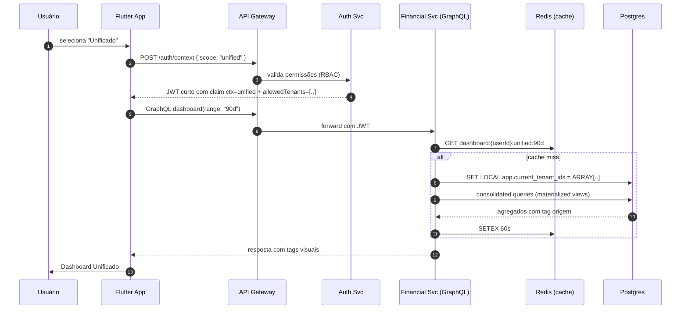
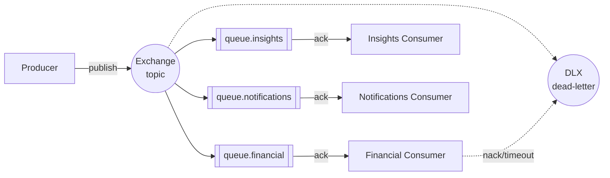

# 02 — Desenho do Sistema

## 1. Visão de alto nível (C4 nível 2 — containers)

## 2. Fluxo canônico: conciliação via Open Finance

## 3. Fluxo: seleção de contexto e Dashboard Unificado

## 4. Decomposição de microserviços

| Serviço | Responsabilidade | Dono de tabelas | Eventos que emite | Eventos que consome |
|---------|------------------|-----------------|-------------------|---------------------|
| **Auth** | Identidade, sessão, MFA, RBAC | `users`, `sessions`, `roles`, `permissions`, `memberships` | `user.created`, `role.changed` | — |
| **Financial** | Lançamentos, categorias, saldos, orçamento | `accounts`, `transactions`, `categories`, `rules`, `budgets` | `transaction.created`, `transaction.categorized`, `balance.changed` | `transactions.imported`, `transactions.matched` |
| **Open Finance** | Conexões bancárias, conciliação, import OFX/XLS | `connections`, `import_jobs`, `bank_matches` | `transactions.imported`, `connection.expired` | `connection.requested` |
| **Operations** | Agenda, orçamentos, propostas, recibos, boletos | `appointments`, `quotes`, `receipts`, `invoices`, `boletos` | `boleto.issued`, `boleto.paid`, `quote.accepted` | `transaction.categorized` (para baixa automática) |
| **Files** | Upload/download de anexos, OCR | `attachments` | `attachment.uploaded`, `ocr.completed` | — |
| **Insights (Python)** | Projeção, reserva ideal, dinheiro livre, ML categorização | `insights`, `ml_models`, `projections` | `insight.generated`, `projection.updated` | `transaction.categorized`, `balance.changed` |
| **Notifications** | Push, email, in-app, preferências | `notif_channels`, `notif_preferences` | `notification.delivered` | `insight.generated`, `boleto.paid`, etc. |

**Regra de ouro**: um serviço é dono exclusivo das suas tabelas. Outros
serviços leem via API ou consumindo eventos — *nunca* SQL direto
cross-service. Isso preserva a opção de extrair o serviço para seu
próprio banco no futuro.

## 5. Estratégia de mensageria

- **Exchange topic** com routing keys estilo
  `transaction.categorized.ctx-<uuid>`.
- **Dead-letter exchange (DLX)** para mensagens que falham 3 vezes —
  inspecionadas por um job de auditoria.
- **Idempotência**: todo consumer verifica `idempotency_key`
  (geralmente `providerTxId` do Pluggy ou hash do OFX) antes de
  persistir, evitando duplicidade em *retries*.
- **Outbox pattern**: eventos são gravados em `event_outbox` na mesma
  transação que muda o estado do agregado; um *relay* publica no
  RabbitMQ. Garante *at-least-once* sem depender de XA.

## 6. API Gateway — responsabilidades

1. **Terminação TLS** e HTTP/3.
2. **Autenticação**: valida JWT de acesso, extrai `userId`, `contextId`,
   `allowedTenants`, `permissions`. Injeta headers `X-Tenant-Id` e
   `X-User-Id` (assinados) para os serviços internos.
3. **Rate-limit**: por usuário (100 req/min) e por IP (300 req/min).
   Buckets específicos para endpoints caros (dashboard unificado: 20
   req/min).
4. **WAF**: regras OWASP Top 10 + custom para SQLi em filtros.
5. **mTLS** para comunicação com serviços internos (certificados rotados
   por cert-manager).
6. **Observabilidade**: injeta `traceparent` W3C em toda requisição.

## 7. Estratégia de versionamento

- API pública: versão no path (`/v1/...`). Quebrar contrato exige `v2`.
- Eventos internos: campo `schemaVersion`. Consumers toleram N-1
  (compatibilidade progressiva).
- Banco: migrações *expand/contract* (nunca drop+create na mesma
  release).

## 8. Ambientes

| Ambiente | Propósito | Dados |
|----------|-----------|-------|
| `local` | dev (docker-compose) | mock + sandbox Pluggy |
| `dev` | integração contínua | sintéticos |
| `staging` | pré-prod espelhando prod | anonimizados |
| `prod` | produção | reais |

Promoção de release: `dev → staging → prod` via pipeline GitOps,
feature flags controladas por Unleash/Flagsmith.
