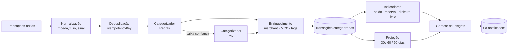

# 03 — Engine de Inteligência Financeira

Um usuário não quer gráficos; quer **respostas**. A Engine de
Inteligência transforma lançamentos normalizados em três produtos:

1. **Indicadores de saúde** (números agregados com significado).
2. **Categorização automática** (toda transação ganha `categoryId` sem
   esforço manual).
3. **Insights acionáveis** (cards que dizem "faça X" ou "cuidado com Y").

Este documento detalha a lógica, as fórmulas e os pontos de integração.

---

## 1. Pipeline geral



Cada estágio é idempotente e pode ser reexecutado sobre a mesma
transação sem efeitos colaterais (ex: quando uma regra é criada/alterada
pelo usuário, o categorizador reprocessa o backlog do contexto).

---

## 2. Categorização automática

### 2.1 Camada de regras (determinística, sempre executa primeiro)

Regras são persistidas em `category_rules` e têm campos:

```ts
interface CategoryRule {
  id: string;
  tenantId: string;            // NULL = regra global (curadoria da plataforma)
  priority: number;            // menor = maior prioridade
  match: {
    description?: string;      // regex PCRE
    merchant?: string;         // igualdade ou regex
    mcc?: string[];            // Merchant Category Code
    amountRange?: [number, number];
    direction?: "in" | "out";
    accountIds?: string[];
  };
  assign: {
    categoryId: string;
    tags?: string[];
    confidence: number;        // 0.0 - 1.0 (geralmente 1.0 para regras explícitas)
  };
}
```

Ordem de match:

1. Regras **do próprio usuário** (ex: "tudo que contém `UBER` na
   descrição → Transporte").
2. Regras **globais curadas** (ex: MCC 5411 → Mercado).
3. Regras de **co-ocorrência** (merchant já visto em outro contexto do
   mesmo usuário → mesma categoria).

Se nenhuma regra casa, ou a `confidence` < 0.8, a transação passa para a
camada ML.

### 2.2 Camada ML (probabilística, só quando necessário)

Modelo: **classificador gradient boosting** (XGBoost ou LightGBM) com
features:

- Embedding da descrição (sentence-transformer multilíngue pequeno, ex:
  `paraphrase-multilingual-MiniLM-L12-v2`, rodando em CPU).
- MCC (one-hot).
- Valor (log-transformado, sinal).
- Dia da semana, hora.
- Merchant normalizado (após limpeza de ruídos estilo
  `PAG*MERCADO 12345`).
- Frequência histórica desse merchant para o usuário.

Treino:

- **Modelo global** treinado offline em dados *rotulados + anonimizados*
  (dados que o usuário confirmou, nunca valores/identificadores
  pessoais). Re-treino semanal.
- **Modelo por usuário** (opcional, fase 2): *fine-tuning* leve com as
  correções manuais do próprio usuário, servido via TorchScript ou ONNX.

Inferência: chamada síncrona RPC (gRPC) ao microserviço Python para
transações recém-importadas. Para backfills em lote, a fila
`insights.categorize.batch` processa em chunks de 1.000.

Saída: `(categoryId, confidence)`. Se `confidence < 0.6`, a UI marca a
transação como "Categoria sugerida — revise" para pedir confirmação
humana, e essa confirmação retroalimenta o treino.

---

## 3. Indicadores de saúde financeira

Todos os indicadores são calculados **por contexto** e agregados quando
o usuário está em modo Unificado. Os resultados ficam em
`indicators_snapshot` com `calculated_at` e `validity_window`.

### 3.1 Dinheiro Livre

> Quanto posso gastar sem comprometer o que já está compromissado até o
> próximo ciclo?

```
DinheiroLivre(ctx, até=D) =
    SaldoAtual(ctx)
  − Σ ObrigaçõesFixas(ctx, [hoje, D])
  − Σ ParcelasAbertas(ctx, [hoje, D])
  − ReservaMínimaOperacional(ctx)
```

Onde:

- `SaldoAtual` é a soma dos saldos de todas as `accounts` ativas no
  contexto.
- `ObrigaçõesFixas` são transações recorrentes detectadas (aluguel,
  salários, assinaturas) com `frequency != null` na tabela
  `recurrences`.
- `ParcelasAbertas` são *installments* com `due_date` entre hoje e D.
- `ReservaMínimaOperacional` é um *buffer* configurável (default: 5%
  da média móvel de gastos dos últimos 30d).

Por padrão, `D = próximo dia de maior concentração de contas (típico:
dia 10)`. O usuário pode trocar para horizonte fixo (ex: "até o fim do
mês").

### 3.2 Reserva de Emergência Ideal

> Quanto eu preciso ter parado para dormir tranquilo?

```
ReservaIdeal(ctx) = multiplier(ctx) × MMG(ctx, 6 meses)
```

Onde:

- `MMG(ctx, n)` = média móvel dos **gastos essenciais** dos últimos n
  meses (categorias `essential = true` — moradia, alimentação, saúde,
  transporte, educação, dívidas mínimas).
- `multiplier(ctx)` é escolhido assim:
  - **PF com renda CLT**: `3`
  - **PF autônomo / CLT em indústria volátil**: `6`
  - **PJ com receita recorrente previsível**: `3`
  - **PJ com receita irregular**: `6–12`

A classificação de volatilidade vem de um cálculo de coeficiente de
variação (σ/μ) da receita mensal em 12 meses:

```
CV < 0.15  →  baixo  →  multiplier = 3
0.15 ≤ CV < 0.35  →  médio  →  multiplier = 4–5
CV ≥ 0.35  →  alto  →  multiplier = 6+
```

A UI mostra duas barras: **"Você tem X"** e **"Ideal: Y"**, com o delta
destacado.

### 3.3 Projeção de fluxo de caixa 30/60/90 dias

Modelo **determinístico em primeiro plano**, probabilístico na fase 2:

1. Parte de `SaldoAtual`.
2. Soma/subtrai recorrências detectadas com data futura (aluguel, conta
   de luz, salário, assinaturas) — identificadas por periodicidade
   estatística: transações com mesmo merchant + valor em janelas
   regulares de 28–31 dias e σ baixo.
3. Soma/subtrai parcelamentos em aberto de `installments`.
4. Para as categorias **variáveis**, projeta pela média móvel
   ponderada dos últimos 90 dias (pesos decrescentes: 50% últimos 30d,
   30% 30–60d, 20% 60–90d).

Saída: série temporal diária. Se a série cruza zero em algum ponto,
gera alerta (ver §4).

**Fase 2 — Monte Carlo**: para cada categoria variável, amostra de uma
distribuição ajustada (log-normal para despesas, normal para receitas
previsíveis) 5.000 vezes; entrega bandas P10/P50/P90 na UI.

### 3.4 Outros indicadores

- **Taxa de Endividamento** =
  `parcelas_abertas_totais / receita_mensal_média`. Verde < 30%,
  amarelo 30–50%, vermelho > 50%.
- **Margem Operacional PJ** =
  `(receita − custos fixos − custos variáveis) / receita`.
- **Runway PJ** (meses que a empresa sobrevive sem receita nova) =
  `caixa_total / burn_rate`.
- **Saúde Geral** (score 0–100): combinação ponderada dos anteriores,
  com explicabilidade (cada fator mostra sua contribuição).

---

## 4. Insights acionáveis

Um insight é um card da UI com estrutura:

```ts
interface Insight {
  id: string;
  tenantId: string;
  type: "cashflow_alert" | "saving_opportunity" | "reserve_gap"
      | "duplicate_subscription" | "fee_anomaly" | "category_spike";
  severity: "info" | "warn" | "critical";
  title: string;                       // "Você vai ficar negativo em 47 dias"
  body: string;                        // explicação em linguagem natural
  evidence: { txIds?: string[]; metrics?: Record<string, number> };
  action?: { label: string; route: string };
  validUntil: Date;
  generatedAt: Date;
}
```

Regras de geração (heurísticas claras, *não* caixa-preta):

| Tipo | Gatilho | Severidade |
|------|---------|------------|
| `cashflow_alert` | Projeção cruza zero em ≤ 30 / 60 / 90 dias | critical / warn / info |
| `reserve_gap` | `ReservaAtual < 0.5 × ReservaIdeal` por 2+ meses | warn |
| `duplicate_subscription` | 2+ merchants distintos com mesma categoria `Streaming` e cobrança mensal | info |
| `fee_anomaly` | Tarifa bancária > média+2σ do próprio usuário | warn |
| `category_spike` | Gasto em categoria > média+2σ dos últimos 6 meses | info |
| `saving_opportunity` | Valor parado em conta-corrente > 1× gasto mensal médio e sem investimento | info |

### 4.1 Geração em linguagem natural

Os textos de `title` e `body` usam **templates parametrizados**, não LLM
— porque:

- Custo zero por insight.
- Saída 100% previsível (evita alucinações em produto financeiro).
- Tradução trivial.

Exemplo de template:

```
"{contextName}: seu saldo projetado fica negativo em {days} dias
 (R$ {shortfall}) por causa de {topDriver}."
```

Fase 3 (opcional): uma LLM pode **reescrever** o body para torná-lo mais
humano, sempre a partir do template determinístico como fonte de
verdade — nunca inferindo números.

### 4.2 Priorização

Quando vários insights coexistem, o feed ordena por:

```
score = severity_weight × recency × actionability
```

Onde `actionability = 1.0` se tem `action.route`, `0.5` caso contrário.
Máximo de 5 cards na home; os demais ficam no "Central de Insights".

---

## 5. Integração com o restante do sistema

- **Trigger**: cada `transaction.categorized` no RabbitMQ acorda a
  Engine para o contexto afetado.
- **Throttle**: recálculos completos são limitados a 1 por contexto por
  minuto (BullMQ `repeat: { limiter }`). Atualizações incrementais
  (saldo, dinheiro livre) são sempre em tempo real.
- **Explicabilidade**: toda decisão da Engine escreve em
  `insights_audit_log` (qual regra, qual modelo, qual versão), essencial
  para suporte e confiança do usuário.
- **Controle do usuário**: o usuário pode desativar insights por tipo,
  aumentar/diminuir sensibilidade, e **corrigir** categorizações —
  correções viram dados de treino.

---

## 6. Decisões explícitas (para não repetir depois)

- ✅ Regras antes de ML (explicabilidade, custo, latência).
- ✅ Indicadores com fórmulas auditáveis; sem caixa-preta para números
  mostrados ao usuário.
- ✅ Templates antes de LLM para textos de insight.
- ⛔ Não usamos "score de crédito" comercial no MVP — é regulado e
  sensível; se necessário, via parceiro especializado.
- ⛔ Não recomendamos investimento no MVP (recomendação financeira
  regulada pela CVM). Mostramos posições e indicadores, não conselhos.
