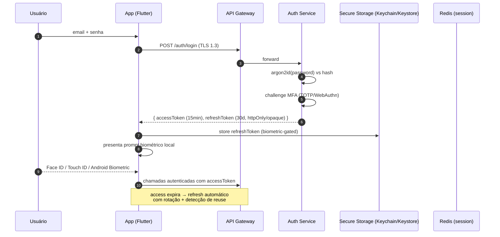

# 04 — Segurança & LGPD

Dados financeiros são **dados pessoais sensíveis**. A tese é *defesa em
profundidade*: mesmo que uma camada falhe, a próxima contém o estrago.

---

## 1. Ameaças consideradas (STRIDE resumido)

| Ameaça | Exemplo concreto | Mitigação principal |
|--------|------------------|---------------------|
| **Spoofing** | Alguém se passa por usuário | OAuth2 + MFA + biometria |
| **Tampering** | Alterar valor de transação em trânsito | TLS 1.3 + mTLS interno + assinatura de eventos |
| **Repudiation** | "Não fui eu que emiti esse boleto" | Audit log append-only com hash encadeado |
| **Info disclosure** | Vazamento de tokens bancários | AES-256-GCM + KMS + *envelope encryption* |
| **DoS** | Exaurir API Gateway | Rate-limit por usuário/IP + WAF + autoscaling |
| **Elevation of privilege** | Contador acessar PF do cliente | RBAC granular + RLS no Postgres |

---

## 2. Autenticação

### 2.1 Fluxo de login



### 2.2 Tokens

- **Access token**: JWT assinado com **EdDSA (Ed25519)**, TTL 15 min.
  Claims: `sub`, `ctx` (contexto ativo), `tenants` (lista permitida),
  `perms` (bitmap), `jti`, `sid`, `iat`, `exp`.
- **Refresh token**: *opaque* (não-JWT), armazenado hasheado em Redis
  com TTL 30 dias. Rotação a cada uso. **Detecção de reuso**: se um
  refresh já utilizado é apresentado, toda a família é revogada
  (comportamento OAuth2 RFC 6819).
- **Chaves de assinatura JWT**: rotação a cada 90 dias, publicadas via
  JWKS endpoint. Suporte a `kid` para validação durante overlap.

### 2.3 MFA

- Obrigatório para ações sensíveis (vincular banco, emitir boleto >
  R$ 5k, alterar permissões, exportar dados).
- Métodos suportados:
  - **TOTP** (RFC 6238) — default.
  - **WebAuthn/Passkeys** — preferencial no longo prazo.
  - **SMS** — apenas *fallback* de último recurso (marcado como fraco).
- **Backup codes**: 10 códigos de uso único gerados na ativação,
  mostrados uma vez, armazenados hasheados (argon2id).

### 2.4 Biometria

- Apenas **gatilho local** para liberar o refresh token do Secure
  Storage. Biometria **não** é enviada ao backend.
- Em iOS: `LAPolicy.biometryAny` com fallback para PIN do dispositivo.
- Em Android: `BiometricPrompt` com `BIOMETRIC_STRONG`.
- No web/PWA: `WebAuthn` com *platform authenticator*.

### 2.5 Proteção de senha

- Hash: **argon2id** (`time=3, memory=64MB, parallelism=4`).
- Política: mínimo 12 caracteres, comparação contra lista do HIBP via
  k-anonymity (`api.pwnedpasswords.com/range/{prefix}`).
- Bloqueio após 5 tentativas falhas em 10 minutos (por email + IP),
  com CAPTCHA progressivo antes do bloqueio total.

---

## 3. Autorização

### 3.1 RBAC granular

A autorização combina três eixos:

1. **Contexto** (PF ou PJ específica).
2. **Tela/recurso** (ex: `invoices`, `insights`, `open-finance`).
3. **Ação** (`read`, `write`, `delete`, `admin`).

Permissões são armazenadas em `memberships` (ver
[07-rbac.md](07-rbac.md)) como tuplas:

```
(userId, tenantId, resource, action) → granted
```

### 3.2 Enforcement em camadas

| Camada | O que valida | Falha gera |
|--------|--------------|------------|
| **Gateway** | JWT válido, não expirado, não revogado | 401 |
| **Service decorator** | `@RequiresPermission('invoices:write')` | 403 |
| **Database RLS** | `tenant_id IN current_setting(...)` | linha não existe |

A redundância é intencional: um bug em qualquer camada isolada não vaza
dados.

### 3.3 Princípio do menor privilégio

- Contas de serviço (workers) têm papéis dedicados com permissões
  mínimas.
- Nenhum serviço usa credenciais de superusuário em produção.
- Chaves de integração (Pluggy, SMTP) são escopadas por ambiente.

---

## 4. Criptografia

### 4.1 Em trânsito

- **TLS 1.3** obrigatório externamente (HSTS com `max-age=63072000`,
  preload).
- **mTLS** interno entre API Gateway e microserviços (certificados
  rotados pelo cert-manager com CA privada).
- Cipher suites modernas apenas (ChaCha20-Poly1305, AES-GCM). Sem TLS
  1.2, sem RSA key exchange.

### 4.2 Em repouso

- Postgres: **TDE** (transparent data encryption) no volume gerenciado.
- S3: **SSE-KMS** com chave dedicada por ambiente.
- Backups: criptografados com chave separada, armazenados em bucket com
  *object lock*.

### 4.3 Envelope encryption para tokens bancários

Tokens OAuth do Pluggy/Belvo são o ativo mais crítico. Usamos
*envelope encryption*:

```
DEK  (Data Encryption Key)  — AES-256, gerada por tenant por integração
KEK  (Key Encryption Key)   — gerenciada pelo KMS/Vault
```

Fluxo de escrita:

```
1. Gera DEK aleatória (32 bytes, CSPRNG).
2. ciphertext = AES-256-GCM(DEK, plaintext_token, iv=nonce_96b, aad=tenantId|integration)
3. wrappedDEK = KMS.encrypt(DEK, keyId=KEK_<env>)
4. Armazena { ciphertext, iv, authTag, wrappedDEK, keyId, algVersion }
5. Zera DEK da memória (Buffer.fill(0))
```

Fluxo de leitura:

```
1. DEK = KMS.decrypt(wrappedDEK, keyId)
2. plaintext = AES-256-GCM-decrypt(DEK, ciphertext, iv, authTag, aad)
3. Usa o token só pelo tempo necessário; descarta.
```

Benefícios:

- Rotação do KEK sem reencriptar todos os dados (só reencripta DEKs).
- Vazamento do DB sozinho **não** revela tokens (faltam DEKs desembrulhadas).
- Auditoria centralizada no KMS (toda `decrypt` fica registrada).

### 4.4 Rotação de chaves

| Artefato | Rotação | Automação |
|----------|---------|-----------|
| JWT signing key | 90 dias | CronJob + JWKS overlap |
| KEK (tokens bancários) | 180 dias | Vault policy |
| TLS externo | Let's Encrypt, 60 dias | cert-manager |
| TLS interno (mTLS) | 30 dias | cert-manager |
| Postgres superuser | trimestral | SOP manual |

---

## 5. LGPD (Lei nº 13.709/2018)

### 5.1 Bases legais

| Operação | Base legal |
|----------|------------|
| Cadastro + uso do app | Execução de contrato (art. 7º, V) |
| Integração Open Finance | Consentimento específico (art. 7º, I) — revogável |
| Envio de marketing | Consentimento opt-in separado (art. 7º, I) |
| Retenção fiscal (NFe/boletos) | Obrigação legal (art. 7º, II) |

### 5.2 Direitos do titular

Cada direito é exposto como **operação idempotente** na API, com
garantia de resposta em ≤ 15 dias úteis (LGPD art. 19):

- **Acesso / portabilidade** (`GET /me/export`): exporta ZIP com JSON +
  CSV de todos os dados do usuário, assinado.
- **Correção** (`PATCH /me/...`): já coberto pela API transacional.
- **Anonimização** (`POST /me/anonymize`): substitui PII por hashes
  irreversíveis, preserva dados agregados.
- **Eliminação** (`DELETE /me`): execução em transação única,
  *cascade* por RLS + workers limpando S3/OpenSearch/caches/logs. Dados
  retidos só por obrigação legal (NFe/boletos) ficam em tabela
  *cold-storage* com acesso restrito.
- **Revogação de consentimento** (`DELETE /connections/:id`): revoga no
  Pluggy/Belvo, apaga tokens, mantém histórico financeiro (que é do
  usuário) a menos que ele peça eliminação.

### 5.3 Minimização de dados

- Não coletamos CPF no cadastro — só quando necessário para emissão de
  boleto/NFe.
- Não coletamos geolocalização precisa.
- Logs estruturados **nunca** incluem PII: regras centralizadas no
  `LoggerInterceptor` filtram campos `email`, `cpf`, `document`,
  `token` via `scrub(fields)`.

### 5.4 DPO e resposta a incidentes

- DPO nomeado (e-mail de contato público).
- **Procedimento de incidente**:
  1. Containment (revogar credenciais/chaves afetadas).
  2. Análise forense (traces + audit log).
  3. Notificação à ANPD em ≤ 72h se houver risco a titulares.
  4. Comunicação aos titulares afetados em linguagem clara.
  5. Post-mortem sem culpa, com ação corretiva.
- **Runbooks** versionados para cenários típicos (KEK comprometida,
  token Pluggy vazado, sessão de admin sequestrada).

### 5.5 DPIA / RIPD

Relatório de Impacto à Proteção de Dados produzido antes do lançamento
de qualquer feature que trate dado sensível novo, incluindo:

- Categorização ML (modelo pode inferir informações sensíveis?).
- Insights que comparam usuário a coorte (evitar reidentificação).

---

## 6. Observabilidade de segurança

- **Audit log append-only** (`audit_log`): toda ação sensível
  (login, MFA, alteração de role, revogação, exportação de dados,
  emissão de boleto) vai para tabela com campo
  `prev_hash` + `row_hash` (hash encadeado) — violações do encadeamento
  indicam adulteração.
- **SIEM**: logs enviados a Loki + regras no Grafana Alerting para
  padrões suspeitos (geo-impossibilidade, múltiplas falhas de MFA,
  exportação massiva).
- **Alertas**:
  - Falha de MFA > 5× em 10min → bloqueio + email.
  - Novo dispositivo/geolocalização → email informativo.
  - Chamada `KMS.decrypt` fora de horário comercial sem job batch
    conhecido → alerta SOC.

---

## 7. Checklist mínimo pré-lançamento

- [ ] Pentest externo (OWASP ASVS L2).
- [ ] Varredura SAST no CI (Semgrep) + SCA (Snyk/OSV).
- [ ] Scan DAST em staging (OWASP ZAP).
- [ ] Revisão de superfície S3 pública = 0 buckets.
- [ ] Backups testados com *restore drill* mensal.
- [ ] Runbook de incidente ensaiado (game day).
- [ ] Política de senha e MFA auditada.
- [ ] LGPD: termo de uso, política de privacidade, DPO publicados.
- [ ] Contratos com operadores (Pluggy, Hostinger) com cláusulas de
      tratamento de dados.
