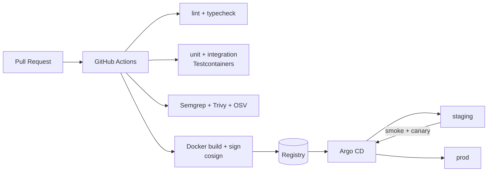

# 05 — Escalabilidade & Infraestrutura

Entregamos na Hostinger porque o requisito é esse. Abaixo, como extrair
o melhor dessa plataforma sem acoplar a arquitetura — permitindo saída
para AWS/GCP sem reescrita se for preciso.

---

## 1. Topologia de produção (Hostinger)

```mermaid
flowchart TB
    subgraph CF[Cloudflare]
        CDN[CDN + WAF + DDoS]
    end

    subgraph HV[Hostinger VPS Cloud — região BR-SP]
        direction TB
        subgraph K[Kubernetes (k3s) — 3 control-plane + N workers]
            ING[Traefik Ingress]
            APPS[Deployments: auth / fin / of / ops / files / notif / insights]
            HPA[Horizontal Pod Autoscalers]
        end
        PG[(PostgreSQL<br/>Managed / replicado)]
        REDIS[(Redis cluster)]
        MQ[(RabbitMQ cluster)]
        VAULT[(HashiCorp Vault<br/>HA)]
    end

    subgraph OS[Hostinger Object Storage]
        BUCK[(Bucket: anexos)]
        BACKUPS[(Bucket: backups)]
    end

    CDN --> ING
    ING --> APPS
    APPS --> PG
    APPS --> REDIS
    APPS --> MQ
    APPS --> VAULT
    APPS --> BUCK
    PG -. WAL .-> BACKUPS
```

### Componentes em detalhe

| Componente | Produto Hostinger | Motivo |
|------------|-------------------|--------|
| **Compute** | VPS Cloud (planos KVM, escala vertical até 96vCPU) | Roda k3s/k8s *self-managed*; liberdade total de stack |
| **Object Storage** | Hostinger Object Storage (S3-compatible) | Anexos e backups; *versioning* e *object-lock* |
| **Postgres gerenciado** | Hostinger Managed Databases (Postgres) | Backups PITR, réplicas, sem cuidar de patching |
| **DNS + TLS** | DNS da Hostinger + Let's Encrypt via cert-manager | Zero custo operacional |
| **CDN / WAF** | Cloudflare (gratuito) em frente | Hostinger não oferece WAF avançado; Cloudflare sim |
| **E-mail transacional** | SendGrid / AWS SES | Evitar queima de IPs no VPS |
| **Push** | Firebase Cloud Messaging + APNs | Gratuito e de mercado |

---

## 2. Kubernetes como camada de abstração

Usar **k3s** (leve, oficial da CNCF) nas VPS da Hostinger dá:

- **Portabilidade**: manifests iguais rodam em AWS EKS, GCP GKE,
  bare-metal. Amanhã migramos sem reescrever código.
- **Autoscaling horizontal** via HPA com métricas de CPU, memória e
  custom (requests/s via Prometheus Adapter).
- **Rolling updates** e *canary* via Argo Rollouts.
- **GitOps** via Argo CD — o repositório `infra` é a fonte de verdade.

### Perfis de pod

| Serviço | Réplicas mínimas | HPA max | Requests CPU / RAM | Observação |
|---------|------------------|---------|--------------------|------------|
| auth | 2 | 8 | 200m / 256Mi | stateless |
| financial | 3 | 12 | 500m / 512Mi | endpoints GraphQL pesados |
| open-finance | 2 | 6 | 300m / 384Mi | limitado pela API Pluggy |
| operations | 2 | 6 | 300m / 384Mi | |
| files | 2 | 8 | 200m / 512Mi | picos no upload |
| notifications | 2 | 4 | 150m / 128Mi | |
| insights (Python) | 2 | 6 | 700m / 1Gi | ML em CPU |
| workers (BullMQ) | 2 | 10 | 300m / 384Mi | escala por *queue depth* |

**PodDisruptionBudget** com `minAvailable: 1` para todos.

**PriorityClasses**: `payments/boletos` > `transactional` > `insights`
> `batch`. Em crise de recursos, insights e batch são os primeiros a
descarte.

---

## 3. Banco de dados

### 3.1 Topologia

- 1 **primary** (writes) + 2 **read replicas** (streaming replication).
- **Connection pooler** PgBouncer em modo `transaction` — crítico para
  NestJS/Prisma não saturar conexões.
- **Backups**:
  - Snapshot diário automático (Hostinger).
  - WAL contínuo para Object Storage → PITR com RPO ≤ 5 min.
  - Restore drill **mensal** em staging.

### 3.2 Particionamento

- `transactions` particionada por `RANGE (created_at)` mensal via
  `pg_partman`. Partições antigas (> 24 meses) compactadas com
  `pg_repack` e movidas para tablespace em disco mais barato.
- `audit_log` particionada por mês, retention 5 anos.

### 3.3 Leitura x escrita

- GraphQL de dashboard e queries analíticas apontam para **read
  replicas** via Prisma `datasource` secundária.
- Consistência eventual aceitável para dashboard (atraso típico < 1s).
- Operações transacionais (transferências, boletos, lançamentos)
  **sempre** no primary.

### 3.4 Materialized views e cache

- MVs por contexto para agregados pesados (`balance_by_category_month`),
  refresh via job após `transaction.categorized`.
- Cache de resposta GraphQL no Redis, key por
  `userId + ctxScope + query + variables`, TTL 60s, invalidação
  pub/sub em mudanças de saldo.

---

## 4. Escalabilidade por dimensão

| Dimensão | Limite esperado | Como escalar |
|----------|-----------------|--------------|
| **Conexões concorrentes** | 10k WebSocket / 50k HTTP | Mais réplicas + PgBouncer + Redis pub/sub |
| **Throughput de transações** | 1k tx/s ingeridas | Particionamento + BullMQ workers |
| **Armazenamento de anexos** | TB/mês | Object Storage (elástico por design) |
| **CPU de Insights (ML)** | picos 2–4× noturnos | HPA + *priority class* baixa; eventual GPU on-demand |
| **Tráfego estático (app web)** | global | Cloudflare CDN |
| **Região** | 1 inicial (BR-SP) | Fase 2: réplica em BR-POA ou US-East para DR |

---

## 5. Resiliência e SLO

### 5.1 Metas

| Indicador | SLO | Consequência |
|-----------|-----|--------------|
| Disponibilidade da API pública | 99.9% mensal | error budget 43min/mês |
| p95 latência GET `/dashboard` | < 400ms | ligar cache agressivo se >80% budget |
| p99 latência transactional write | < 800ms | abrir incidente se excedido 2d |
| RPO (Postgres) | ≤ 5 min | ajuste de WAL shipping |
| RTO | ≤ 30 min | runbook de restore |

### 5.2 Degradação graciosa

- **Pluggy indisponível** → app continua, mostra banner, usuário pode
  lançar manual.
- **Insights Engine fora** → dashboard exibe números, *cards* de
  insight somem com texto explicativo, não com erro.
- **Notifications fora** → fila acumula até 24h (RabbitMQ com
  `max-length-bytes`), drena depois.

### 5.3 Circuit breakers

Envelope `opossum` (Node) e `pybreaker` (Python) em toda chamada
externa (Pluggy, SMTP, SMS, boletos). Estado do breaker exportado em
métricas.

---

## 6. CI/CD



- **Progressive delivery**: canary 5% → 25% → 100% com análise
  automática por Prometheus (taxa de erro, p95).
- **Rollback** em um comando via Argo Rollouts.
- **Imagens assinadas** com cosign; Kyverno bloqueia imagens não
  assinadas no admission controller.

---

## 7. Observabilidade

| Sinal | Tool | Retenção |
|-------|------|----------|
| Métricas | Prometheus + Grafana | 30d quente / 1 ano frio (Mimir) |
| Logs | Loki (estruturados, JSON) | 30d |
| Traces | Tempo (OpenTelemetry) | 7d |
| Erros app | Sentry (backend + Flutter) | 90d |
| Uptime externo | UptimeRobot / Better Stack | — |

Dashboards padrão: *Golden Signals* (latency, traffic, errors,
saturation) por serviço + dashboards de negócio (transações
importadas/min, boletos emitidos, insights gerados).

---

## 8. Custos (ordem de grandeza, estimativa inicial)

Para 10k usuários ativos, assumindo 100 tx/usuário/mês:

| Item | Mensal |
|------|--------|
| VPS Cloud (3× 8vCPU/16GB + 2× 4vCPU/8GB) | ~US$ 180 |
| Managed Postgres (primary + replica) | ~US$ 90 |
| Object Storage (2TB + egress) | ~US$ 25 |
| Cloudflare Pro | US$ 20 |
| SES + FCM | ~US$ 10 |
| Pluggy (conexões ativas) | variável, ~US$ 0,30/conexão/mês |
| **Total infra base (sem Pluggy)** | **~US$ 325** |

Para 100k usuários, escala linearmente em compute e Postgres, sublinear
em storage (compressão/partições frias).

---

## 9. Disaster Recovery

- **Runbook documentado** (`/runbooks/dr.md`, futuro) cobrindo:
  restore PITR, rotina de failover Redis/RabbitMQ, recriação de
  cluster k3s em região secundária.
- **Game day trimestral** exercitando cenários: perda total do
  primary, perda do bucket de anexos, Pluggy offline por 48h.
- **Backups verificados**: job semanal baixa um snapshot aleatório,
  restaura em ambiente isolado, roda `SELECT count(*) FROM
  transactions` contra o valor esperado — alerta se diverge.

---

## 10. Saída da Hostinger (migration-ready)

Evitamos *lock-in* com as seguintes decisões:

- Kubernetes em vez de serverless proprietário.
- Storage via interface S3 (AWS/GCP/R2 têm o mesmo protocolo).
- Postgres padrão (não extensões proprietárias exclusivas).
- Terraform para provisionar VPS, DNS, buckets — trocar provider é
  trocar módulo.
- Observabilidade open-source (Prometheus, Loki, Tempo) — portável.

Essa postura custa pouco hoje e vale muito no dia que o crescimento
pedir outra nuvem.
