# 06 — Modelo de Dados & Multi-tenancy

Esqueleto inicial do schema. O objetivo aqui **não** é listar toda tabela,
e sim mostrar:

1. Como o multi-tenancy é materializado.
2. Como o core financeiro é modelado (contas, transações,
   parcelamentos, recorrências).
3. Onde RLS é aplicado e como sessão/transação injetam o tenant.

O schema oficial vive em `prisma/schema.prisma` (futuro). Tudo abaixo é
DDL equivalente em PostgreSQL 16.

---

## 1. Diagrama ER simplificado

```mermaid
erDiagram
    USERS ||--o{ MEMBERSHIPS : "é membro"
    TENANTS ||--o{ MEMBERSHIPS : "tem membros"
    TENANTS ||--o{ ACCOUNTS : "possui"
    TENANTS ||--o{ TRANSACTIONS : "lança"
    TENANTS ||--o{ CATEGORIES : "define"
    TENANTS ||--o{ CONNECTIONS : "conecta"
    ACCOUNTS ||--o{ TRANSACTIONS : "origem/destino"
    TRANSACTIONS }o--|| CATEGORIES : "classificada como"
    TRANSACTIONS ||--o{ INSTALLMENTS : "parcelas"
    TRANSACTIONS ||--o{ ATTACHMENTS : "anexos"
    CONNECTIONS ||--o{ IMPORT_JOBS : "origina"
    IMPORT_JOBS ||--o{ TRANSACTIONS : "produz"
    TENANTS ||--o{ INSIGHTS : "recebe"
    TENANTS ||--o{ RECURRENCES : "tem"

    USERS {
        uuid id PK
        text email UK
        text password_hash
        text mfa_secret_enc
        timestamptz created_at
    }
    TENANTS {
        uuid id PK
        text display_name
        text kind "pf|pj"
        text document "cpf|cnpj (encrypted)"
        uuid owner_user_id FK
        jsonb tags
    }
    MEMBERSHIPS {
        uuid id PK
        uuid user_id FK
        uuid tenant_id FK
        text role "owner|partner|accountant|viewer|custom"
        jsonb permissions_bitmap
    }
    ACCOUNTS {
        uuid id PK
        uuid tenant_id FK
        text name
        text kind "checking|savings|credit_card|cash|investment"
        text bank_code
        numeric balance_current
    }
    TRANSACTIONS {
        uuid id PK
        uuid tenant_id FK
        uuid account_id FK
        uuid category_id FK
        numeric amount
        text direction "in|out"
        date effective_date
        text description
        text idempotency_key UK
        jsonb metadata
    }
    INSTALLMENTS {
        uuid id PK
        uuid parent_transaction_id FK
        uuid tenant_id FK
        int seq
        int total
        date due_date
        numeric amount
        text status "open|paid|overdue"
    }
    RECURRENCES {
        uuid id PK
        uuid tenant_id FK
        text pattern "monthly|weekly|yearly|cron"
        numeric expected_amount
        text merchant
        date next_due
    }
    CONNECTIONS {
        uuid id PK
        uuid tenant_id FK
        text provider "pluggy|belvo|manual"
        text provider_item_id
        bytea token_ciphertext
        bytea token_iv
        bytea token_auth_tag
        bytea wrapped_dek
        text kms_key_id
        timestamptz expires_at
    }
```



---

## 2. Multi-tenancy via Row-Level Security

### 2.1 Convenção

- Toda tabela de domínio tem coluna `tenant_id UUID NOT NULL`.
- `tenants` guarda tanto PF quanto PJ (distinguidos por `kind`).
- Um usuário pode ter N `memberships` — é assim que "PF + múltiplas PJs"
  se materializa.

### 2.2 Session vars injetadas pelo backend

Todo request autenticado abre uma transação e executa:

```sql
SET LOCAL app.current_user_id     = '<uuid do usuário>';
SET LOCAL app.current_tenant_ids  = 'uuid1,uuid2,uuid3';  -- lista CSV
SET LOCAL app.context_mode        = 'single'; -- ou 'unified'
```

No Prisma, isso é um *middleware* que roda em `$transaction` antes de
qualquer query do request.

### 2.3 Policies

```sql
ALTER TABLE transactions ENABLE ROW LEVEL SECURITY;

CREATE POLICY tenant_read ON transactions
  FOR SELECT
  USING (
    tenant_id::text = ANY (
      string_to_array(current_setting('app.current_tenant_ids', true), ',')
    )
  );

CREATE POLICY tenant_write ON transactions
  FOR INSERT WITH CHECK (
    tenant_id::text = ANY (
      string_to_array(current_setting('app.current_tenant_ids', true), ',')
    )
  );

CREATE POLICY tenant_update ON transactions
  FOR UPDATE
  USING (
    tenant_id::text = ANY (
      string_to_array(current_setting('app.current_tenant_ids', true), ',')
    )
  );
```

Aplica-se equivalente em `accounts`, `categories`, `connections`,
`installments`, `recurrences`, `insights`, `attachments`, `appointments`,
`quotes`, `receipts`, `invoices`, `boletos`.

### 2.4 Casos especiais

- **Admin/Support** usa um papel Postgres separado (`app_support`) com
  policy permissiva, nunca o mesmo usuário da aplicação.
- **Dashboard Unificado** seta todos os `tenant_ids` permitidos na
  session var; o `WHERE` implícito do RLS cuida do resto — a aplicação
  não adiciona filtros redundantes.
- **Eventos outbox** (`event_outbox`) ficam fora de RLS (acesso só pelo
  relay), mas têm `tenant_id` para roteamento correto do routing key.

---

## 3. Decisões de modelagem importantes

### 3.1 Valores monetários

- Tipo: `NUMERIC(19,4)` — nunca `float`.
- Moeda: coluna `currency CHAR(3)` (ISO-4217). MVP só BRL, mas estamos
  preparados.
- Conversões: tabela `fx_rates` alimentada diariamente.

### 3.2 Idempotência

- `transactions.idempotency_key` `TEXT UNIQUE`. Vem do provedor
  (ex: `pluggy_tx_id`) ou de um hash estável do conteúdo do OFX.
- Consumers de fila fazem `INSERT ... ON CONFLICT DO NOTHING` usando
  essa chave.

### 3.3 Parcelamentos

- Uma **compra parcelada** gera 1 transação "mãe" + N `installments`.
- Cada `installment` pode ter seu próprio lançamento real posterior
  (quando a fatura é paga) — ligado por `matched_transaction_id`.

### 3.4 Recorrências

- Detectadas estatisticamente (mesmo merchant, mesmo valor ±5%, período
  regular 28–31d), confirmadas pelo usuário na primeira ocorrência.
- Usadas pela Engine de Inteligência para projetar fluxo de caixa (ver
  [03-intelligence-engine.md](03-intelligence-engine.md)).

### 3.5 Soft delete

- Padrão: campo `deleted_at TIMESTAMPTZ NULL`; policies filtram.
- Exceção: ações LGPD de eliminação fazem `DELETE` real + `VACUUM FULL`
  programado na partição.

### 3.6 Audit log

```sql
CREATE TABLE audit_log (
  id           BIGSERIAL PRIMARY KEY,
  tenant_id    UUID,
  user_id      UUID,
  action       TEXT NOT NULL,
  resource     TEXT NOT NULL,
  resource_id  TEXT,
  metadata     JSONB,
  prev_hash    BYTEA,
  row_hash     BYTEA NOT NULL,
  created_at   TIMESTAMPTZ NOT NULL DEFAULT now()
);

CREATE INDEX ON audit_log (tenant_id, created_at DESC);
CREATE INDEX ON audit_log (user_id, created_at DESC);
```

`row_hash = SHA256(prev_hash || canonicalJSON(row))`. Violação do
encadeamento detectável por job diário.

---

## 4. Índices críticos

```sql
-- Consultas por conta no tempo (extrato)
CREATE INDEX ix_tx_account_date
  ON transactions (tenant_id, account_id, effective_date DESC);

-- Agregações por categoria em janelas
CREATE INDEX ix_tx_category_date
  ON transactions (tenant_id, category_id, effective_date);

-- Busca fuzzy em descrição
CREATE INDEX ix_tx_desc_trgm
  ON transactions USING gin (description gin_trgm_ops);

-- Dedupe
CREATE UNIQUE INDEX ix_tx_idempotency
  ON transactions (idempotency_key);

-- Parcelas a vencer
CREATE INDEX ix_installments_due
  ON installments (tenant_id, status, due_date)
  WHERE status IN ('open', 'overdue');
```

---

## 5. Migrações

- Ferramenta: Prisma Migrate (ou `pg-migrate` se for adotado SQL-first).
- Política **expand/contract**:
  1. *Expand*: adiciona coluna nova com default, lê de ambos.
  2. Deploy do app escrevendo em ambos.
  3. Backfill assíncrono.
  4. *Contract*: remove coluna antiga em release posterior.
- Nunca `DROP COLUMN` + `ADD COLUMN` na mesma PR/release.

---

## 6. Exemplo de query consolidada (Dashboard Unificado)

```sql
-- Dentro de transação com SET LOCAL app.current_tenant_ids = '...'
WITH range AS (
  SELECT date_trunc('day', now()) - INTERVAL '89 day' AS from_d,
         date_trunc('day', now())                     AS to_d
)
SELECT
  t.tenant_id,
  tn.display_name,
  tn.kind,
  c.name              AS category,
  SUM(t.amount) FILTER (WHERE t.direction = 'in')  AS income,
  SUM(t.amount) FILTER (WHERE t.direction = 'out') AS expense
FROM transactions t
JOIN tenants    tn ON tn.id = t.tenant_id
JOIN categories c  ON c.id  = t.category_id
CROSS JOIN range r
WHERE t.effective_date BETWEEN r.from_d AND r.to_d
GROUP BY t.tenant_id, tn.display_name, tn.kind, c.name
ORDER BY tn.kind, tn.display_name, category;
```

O `WHERE` por tenant é aplicado automaticamente pela policy de RLS —
a query fica limpa e **segura por construção**.
