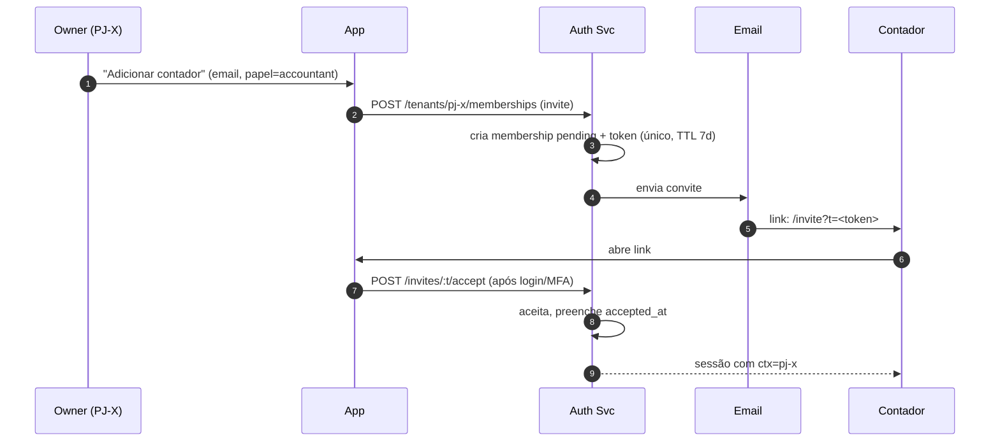

# 07 — RBAC Granular

O exemplo canônico do briefing — "o contador vê a PJ X mas não a PF" —
exige um RBAC que se projete **por contexto × por tela × por ação**.
Este documento define o modelo, os papéis pré-definidos, e como o
enforcement é feito em três camadas.

---

## 1. Modelo de permissões

Uma permissão é a tripla:

```
(resource, action, scope)
```

Onde:

- **resource**: tela/módulo (`accounts`, `transactions`, `invoices`,
  `insights`, `connections`, `members`, `operations`, `attachments`,
  `reports`, `billing`).
- **action**: `read`, `write`, `delete`, `approve`, `export`, `admin`.
- **scope**: `tenant:<uuid>` (um contexto específico) ou `tenant:*`
  (todos os contextos que o usuário é membro).

A associação usuário ↔ tenant é a linha em `memberships`, que carrega
**um conjunto** de permissões (representado como bitmap + overrides
JSON, ver §5).

---

## 2. Papéis pré-definidos (templates)

Um usuário não é "admin" global do sistema; ele é "owner" de um
**tenant** específico. Abaixo os templates que inicializam permissões
— sempre editáveis depois.

| Papel | Escopo típico | Permissões |
|-------|---------------|------------|
| **owner** | PF própria ou PJ criada | tudo em tudo |
| **partner** (sócio) | PJ | tudo **exceto** excluir tenant, gerenciar billing do plano |
| **accountant** (contador) | PJ(s) autorizada(s) | `read` em tudo; `write` em `transactions`, `categories`, `reports`; `export` em `reports`; **sem acesso** a `members`, `connections`, `billing` |
| **operator** (colaborador) | PJ | `read` dashboard; `write` em `invoices`, `appointments`, `quotes`, `receipts`, `attachments`; sem `insights` sensíveis |
| **viewer** | PF ou PJ | `read` em `dashboard`, `insights`, `reports`; nada mais |
| **custom** | qualquer | definido ponto a ponto |

---

## 3. Matriz detalhada (MVP)

Legenda: **R** read · **W** write · **D** delete · **A** approve/admin ·
**X** export · `—` sem acesso.

| Recurso \ Papel | owner | partner | accountant | operator | viewer |
|-----------------|:-----:|:-------:|:----------:|:--------:|:------:|
| Dashboard / Indicadores | R | R | R | R | R |
| Accounts | RWDA | RWD | R | R | R |
| Transactions | RWDA | RWD | RWX | R | R |
| Categories & Rules | RWDA | RWD | RW | R | R |
| Connections (Open Finance) | RWDA | RWD | — | — | — |
| Imports (OFX/XLS) | RWDA | RWD | RW | — | — |
| Installments / Recurrences | RWDA | RWD | R | R | R |
| Insights | RW | RW | R | R | R |
| Operations — Agenda | RWDA | RWD | — | RW | R |
| Operations — Quotes / Propostas | RWDA | RWD | R | RW | R |
| Operations — Receipts | RWDA | RWD | R | RW | R |
| Operations — Invoices / Boletos | RWDA | RWD+A (aprovar) | R | RW (emitir) | R |
| Attachments | RWD | RWD | R | RW | R |
| Reports | RWX | RWX | RWX | RX | RX |
| Members (RBAC) | RWDA | RW | — | — | — |
| Billing do plano (cobrança MaestroFinanças) | RWDA | — | — | — | — |
| Tenant settings | RWDA | RW | — | — | — |
| Audit log | R | R | R (só próprias ações) | R (só próprias ações) | — |

Notas:

- **Emissão de boleto** exige MFA recente (`< 5 min`) mesmo para
  `owner`.
- **Exportação** (`X`) sempre é auditada com `action='export'` no
  `audit_log`.
- **Contador** (`accountant`) deliberadamente **não vê** `connections`
  nem `billing` — essas são responsabilidade do dono.

---

## 4. Caso do briefing: contador na PJ X, sem PF

Concretamente:

```
userId = "u-123" (o contador)

memberships:
  { user_id: u-123, tenant_id: pj-x,  role: accountant, perms: (template) }

// NENHUMA linha com tenant_id = pf-do-cliente
```

No login, a claim JWT recebe:

```json
{
  "sub": "u-123",
  "tenants": ["pj-x"],
  "ctx": "pj-x",
  "perms": "base64(bitmap)"
}
```

No Postgres:

```sql
SET LOCAL app.current_tenant_ids = 'pj-x';
```

RLS garante que **mesmo uma query mal escrita** na aplicação não
retorna nada da PF do cliente. Triple-layer defense: JWT → decorator
→ RLS.

---

## 5. Representação em banco

```sql
CREATE TABLE memberships (
  id                 UUID PRIMARY KEY DEFAULT gen_random_uuid(),
  user_id            UUID NOT NULL REFERENCES users(id),
  tenant_id          UUID NOT NULL REFERENCES tenants(id),
  role               TEXT NOT NULL CHECK (role IN
                       ('owner','partner','accountant','operator','viewer','custom')),
  permissions_bitmap BIGINT NOT NULL DEFAULT 0,
  permissions_custom JSONB NOT NULL DEFAULT '{}',
  invited_by         UUID REFERENCES users(id),
  accepted_at        TIMESTAMPTZ,
  created_at         TIMESTAMPTZ NOT NULL DEFAULT now(),
  UNIQUE (user_id, tenant_id)
);

CREATE INDEX ON memberships (user_id);
CREATE INDEX ON memberships (tenant_id);
```

- **`permissions_bitmap`**: template do papel, rápido de checar.
- **`permissions_custom`**: overrides por recurso específico, em JSONB:

```json
{
  "invoices:approve": true,
  "connections:read":  false
}
```

Resolução: efetivo = `bitmap_template(role)` OR/AND overrides.

---

## 6. Enforcement

### 6.1 Camada de API (decorator NestJS)

```ts
@Controller('invoices')
export class InvoicesController {
  @Post()
  @RequiresPermission('invoices:write')
  @RequiresRecentMFA({ maxAgeSec: 300 })   // para ações sensíveis
  issue(@Body() dto: IssueInvoiceDto) { ... }
}
```

O guard:

1. Extrai `perms` da claim JWT.
2. Verifica o bit correspondente ao par `invoices:write`.
3. Verifica o `ctx` ativo contra `allowedTenants`.
4. Se exigir MFA recente, consulta `sessions.mfa_last_at`.

### 6.2 Camada de domínio

Regras de negócio não expressáveis em permissões puras (ex: "só aprova
boleto se valor ≤ limite configurado") vivem no serviço, não no
decorator.

### 6.3 Camada de banco (RLS)

Mesmo que as duas camadas anteriores falhem, **nenhuma linha de outro
tenant vaza**. Ver [06-data-model.md](06-data-model.md) §2.

---

## 7. Convite e onboarding de novos membros



- Convites expiram em 7 dias.
- Aceitação exige MFA ativo na conta do convidado.
- Owner pode revogar a qualquer momento → remove `membership` e
  invalida sessões ativas daquele usuário naquele tenant (via revogação
  de `sid` em Redis).

---

## 8. Audit trail de RBAC

Toda mudança em `memberships` escreve no `audit_log`:

- `membership.created`
- `membership.role_changed` (antes/depois)
- `membership.permission_toggled` (recurso + ação + valor)
- `membership.revoked`
- `invite.sent`, `invite.accepted`, `invite.expired`

Isso é pré-requisito regulatório (LGPD, contabilidade) e ferramenta de
confiança: o owner consegue auditar quem fez o quê a qualquer momento.

---

## 9. Testes obrigatórios

Suite de testes E2E específica para vazamento cross-tenant:

- Usuário A (membro de `pf-a` e `pj-a`) tenta ler `pj-b` → 403 + 0 rows.
- Contador de `pj-x` tenta listar `connections` → 403.
- JWT com `tenants: [pj-x]` + query GraphQL pedindo `pj-y` → 403.
- RLS standalone: executar query da aplicação como usuário Postgres
  `app_user` com session var errada e garantir 0 rows.

Esses testes devem ser **obrigatórios** no pipeline — nunca *skippable*.
