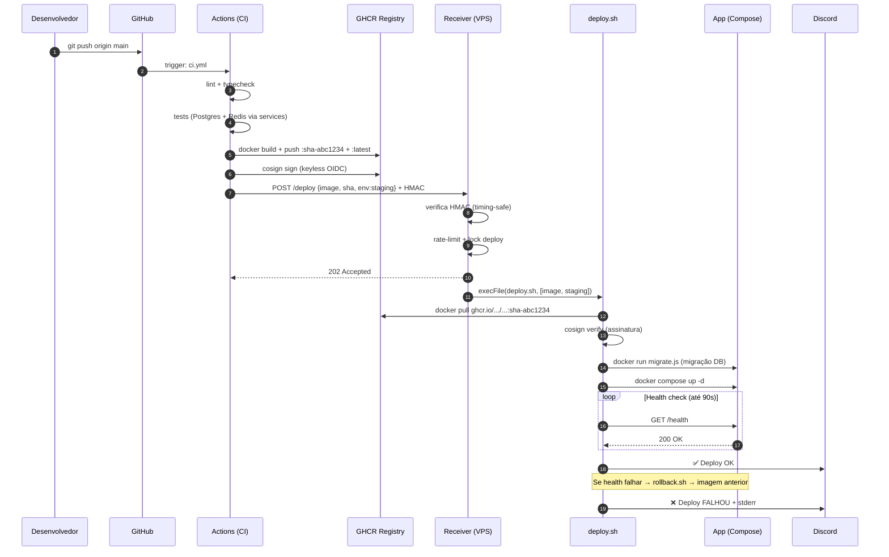

# 08 — CI/CD & Deploy Automático a partir do Main

## Decisões adotadas (resumo executivo)

| Decisão | Escolha | Motivo |
|---------|---------|--------|
| Modelo de deploy | **Webhook-pull** (VPS "puxa") | Menos superfície de ataque; VPS não precisa de IP de saída especial |
| Fallback | Actions → SSH (se VPS não tiver IP fixo) | Redundância |
| Build | **GitHub Actions** (VPS só recebe imagem pronta) | VPS não compila; pipeline reproduzível |
| Registry | **GHCR** (`ghcr.io/devchave/...`) | Grátis, integrado, imutável por digest |
| Assinatura | **cosign** keyless via OIDC | Zero chave privada para gerenciar |
| Runtime Fase 1 | **Docker + Compose** por ambiente | Simples, sem k8s overhead |
| Ambientes | `staging` (auto, cada push em main) + `production` (tag `v*.*.*` + approval) | App financeiro não vai direto pra prod sem gate |
| Health check | `GET /health` HTTP 200 × 18 tentativas × 5s = 90s máximo | Antes de declarar deploy OK |
| Rollback | Automático em falha de health; manual disponível | Zero intervenção para casos comuns |
| Notificação | Discord webhook | Custo zero, sem plugin extra |
| Secrets | GitHub Secrets + `/etc/maestro/receiver.env` (600) | Nunca no repo |

---

## Objetivos e não-objetivos

**Objetivos:**
- Deploy automático em staging a cada push no `main`.
- Deploy controlado em produção (tag git + approval manual no GitHub).
- VPS puxa imagem do GitHub Container Registry via webhook — sem abrir SSH para o mundo.
- Rollback automático se o health check falhar após o deploy.
- Zero intervenção manual no fluxo normal de staging.
- Observabilidade completa (log append-only + Discord).

**Não-objetivos:**
- Deploy automático direto em produção sem aprovação (inaceitável para app financeiro).
- Gerenciar código ou banco de dados fora do escopo desta pipeline.
- Multi-região (Fase 2 — Argo CD + k3s).

---

## Topologia

```mermaid
flowchart LR
    subgraph GH["GitHub"]
        REPO[Repositório\nmain / tags]
        ACTIONS[GitHub Actions\nCI + build + push]
        GHCR[("GHCR\nghcr.io/devchave/...")]
        ENV_STG[Environment:\nstaging]
        ENV_PRD[Environment:\nproduction ✋]
    end

    subgraph VPS_STG["VPS Staging (Hostinger)"]
        RCV_S[Receiver\n:9000]
        SH_S[deploy.sh]
        APP_S[App containers\n(Compose)]
    end

    subgraph VPS_PRD["VPS Produção (Hostinger)"]
        RCV_P[Receiver\n:9000]
        SH_P[deploy.sh]
        APP_P[App containers\n(Compose)]
    end

    REPO -->|push main| ACTIONS
    ACTIONS -->|build + push| GHCR
    ACTIONS -->|"POST /deploy\n(HMAC)"| ENV_STG
    ENV_STG --> RCV_S
    RCV_S --> SH_S
    SH_S -->|docker pull| GHCR
    SH_S --> APP_S

    REPO -->|"tag v*.*.*\n+ approval manual"| ENV_PRD
    ENV_PRD --> RCV_P
    RCV_P --> SH_P
    SH_P -->|docker pull| GHCR
    SH_P --> APP_P
```

---

## Fluxo E2E (sequência completa)



---

## Estrutura dos arquivos de deploy

```
deploy/
├── github-actions/
│   ├── ci.yml                ← build, test, push imagem, disparo staging
│   └── deploy-prod.yml       ← deploy produção (tag + approval)
└── vps/
    ├── receiver/
    │   └── index.js          ← HTTP receiver (Node 22, ESM)
    ├── deploy.sh             ← pull + migrate + compose up + health
    ├── rollback.sh           ← rollback automático ou manual
    ├── maestro-deploy.service← systemd unit (hardened)
    └── setup-vps.sh          ← setup inicial completo da VPS
```

> **Como usar os templates**: copie `deploy/github-actions/*.yml` para
> `.github/workflows/` na raiz do projeto, e rode `setup-vps.sh` na VPS
> **uma única vez**. Detalhes em §Passo a passo abaixo.

---

## Pré-requisitos da VPS

Execute `deploy/vps/setup-vps.sh` como root. O script instala e configura:

1. Docker + Compose v2
2. cosign (verificação de assinatura)
3. Node.js 22 LTS
4. Usuário `deploy` (sem senha, no grupo `docker`)
5. Diretórios `/opt/maestro/{receiver,staging,production}` e `/var/log/maestro`
6. `/etc/maestro/receiver.env` (600) — **você só precisa preencher `WEBHOOK_SECRET`**
7. nginx como proxy reverso com TLS (Let's Encrypt)
8. UFW (portas 22, 80, 443)
9. Systemd unit `maestro-deploy.service`

Após o setup, os únicos passos manuais são:
- Preencher `WEBHOOK_SECRET` em `/etc/maestro/receiver.env`.
- Rodar `certbot --nginx -d <seu-dominio>`.
- Criar os `docker-compose.yml` e `.env` em `/opt/maestro/staging/` e `/opt/maestro/production/`.
- `systemctl start maestro-deploy`.
- Adicionar os secrets no GitHub (ver §Secrets abaixo).

---

## Secrets do GitHub necessários

Acesse: **Settings → Secrets and variables → Actions**

| Secret | Onde usar | Descrição |
|--------|-----------|-----------|
| `STAGING_WEBHOOK_SECRET` | ci.yml | Segredo HMAC do receiver de staging |
| `STAGING_RECEIVER_URL` | ci.yml | `https://<domínio-staging>` |
| `PROD_WEBHOOK_SECRET` | deploy-prod.yml | Segredo HMAC do receiver de prod |
| `PROD_RECEIVER_URL` | deploy-prod.yml | `https://<domínio-prod>` |

O `GITHUB_TOKEN` (para push no GHCR) é **automático** — não precisa criar.

---

## Segurança

### HMAC no webhook

O receiver verifica `X-Hub-Signature-256` usando `crypto.timingSafeEqual` — imune a timing attacks. Qualquer payload sem assinatura válida recebe 401 imediatamente.

### Usuário `deploy` com privilégios mínimos

- Sem senha, sem chave SSH pública de acesso externo.
- Só tem acesso ao grupo `docker` e às pastas `/opt/maestro` e `/var/log/maestro`.
- O receiver roda nesse usuário via systemd com `NoNewPrivileges=true`.

### VPS não exposta diretamente

- O receiver só ouve em `127.0.0.1:9000`.
- O nginx faz TLS termination e só repassa `/deploy`, `/health`, `/status`.
- UFW bloqueia todo o resto.

### Verificação de assinatura da imagem (cosign)

`deploy.sh` verifica a assinatura cosign antes de subir qualquer imagem. Uma imagem não assinada pelos workflows do repositório é rejeitada — proteção contra imagens maliciosas no registry.

### Rotação de segredos

| Artefato | Frequência sugerida |
|----------|---------------------|
| `WEBHOOK_SECRET` | A cada 90 dias ou troca de colaborador |
| Chave TLS | Automático pelo certbot (60 dias) |

---

## Observabilidade do deploy

### Log append-only (`/var/log/maestro/deploys.jsonl`)

Cada evento grava uma linha JSON:

```json
{"ts":"2026-04-24T12:00:00Z","event":"deploy.started","image":"ghcr.io/.../...:sha-abc1234","env":"staging"}
{"ts":"2026-04-24T12:01:15Z","event":"deploy.success","image":"ghcr.io/.../...:sha-abc1234","env":"staging"}
```

Eventos possíveis: `deploy.started`, `deploy.success`, `deploy.failed`,
`deploy.rejected` (assinatura inválida).

### Discord

Cada deploy emite 2 notificações: início e resultado. Em falha, inclui os primeiros 1.500 chars do stderr.

### Histórico de deploys (comando rápido)

```bash
# Na VPS:
tail -f /var/log/maestro/deploys.jsonl | jq .
# Últimos 10 deploys de produção:
grep '"production"' /var/log/maestro/deploys.jsonl | tail -10 | jq .
```

---

## Migrações de banco

Ordem garantida pelo `deploy.sh`:

```
1. docker pull (nova imagem)
2. cosign verify
3. docker run migrate.js   ← migração roda ANTES de subir a app
4. docker compose up -d    ← app nova sobe
5. health check
6. rollback se falhar
```

A migração roda em container **efêmero** com acesso ao banco mas **sem** tráfego de usuário. Se falhar, o `deploy.sh` para com `die()` antes de tocar nos containers da app — o banco fica no estado anterior.

**Política expand/contract**: adicione colunas com `DEFAULT` (expand), deixe a release rodar, só remova a coluna antiga em release posterior (contract). Nunca `DROP` e `ADD` na mesma release.

---

## Blue-green leve (opcional, Fase 1.5)

Quando zero-downtime for crítico, substitua o `compose up` pelo seguinte padrão:

1. Sobe a nova stack em porta diferente (ex: `blue` em 8080, `green` em 8081).
2. Health check na porta nova.
3. nginx recarrega config apontando para a porta nova (`nginx -s reload` — zero-downtime).
4. Para a stack velha.

Templates para isso ficam em `deploy/vps/blue-green/` (Fase 1.5).

---

## Evolução para GitOps — Argo CD (Fase 2)

Quando migrar para k3s (ver [05-scalability-infra.md](05-scalability-infra.md)):

1. O `ci.yml` **não muda**: continua buildando e assinando imagens.
2. Argo CD passa a fazer o papel do receiver + deploy.sh:
   - Argo CD observa o repositório `infra` (Helm charts / Kustomize).
   - O `ci.yml` atualiza o `values.yaml` com a nova tag via PR automático.
   - Argo CD sincroniza o cluster automaticamente (staging) ou aguarda approval (prod).
3. O receiver e o systemd service são desativados.

A migração é aditiva — o receiver coexiste com o Argo CD durante a transição.

---

## Checklist pré-primeiro-deploy

### VPS

- [ ] `setup-vps.sh` executado sem erros.
- [ ] `/etc/maestro/receiver.env` preenchido (`WEBHOOK_SECRET` definido).
- [ ] TLS obtido: `certbot --nginx -d <domínio>`.
- [ ] `/opt/maestro/staging/docker-compose.yml` criado.
- [ ] `/opt/maestro/staging/.env` criado com variáveis de app.
- [ ] `systemctl start maestro-deploy` && `systemctl status maestro-deploy` → active.
- [ ] `curl https://<domínio>/health` → `{"ok":true}`.

### GitHub

- [ ] Secrets adicionados (`STAGING_WEBHOOK_SECRET`, `STAGING_RECEIVER_URL`).
- [ ] `deploy/github-actions/ci.yml` copiado para `.github/workflows/ci.yml`.
- [ ] Environment `staging` criado (Settings → Environments).
- [ ] Branch protection em `main` ativada (require PR + CI).
- [ ] First push em `main` após setup: pipeline verde + Discord notifica.

### Produção (quando chegar a hora)

- [ ] `deploy/github-actions/deploy-prod.yml` copiado para `.github/workflows/`.
- [ ] Secrets de prod adicionados (`PROD_WEBHOOK_SECRET`, `PROD_RECEIVER_URL`).
- [ ] Environment `production` criado com **Required reviewers**.
- [ ] `/opt/maestro/production/` configurado na VPS de prod.
- [ ] Teste: `git tag v0.1.0 && git push origin v0.1.0` → approve → Discord notifica.
